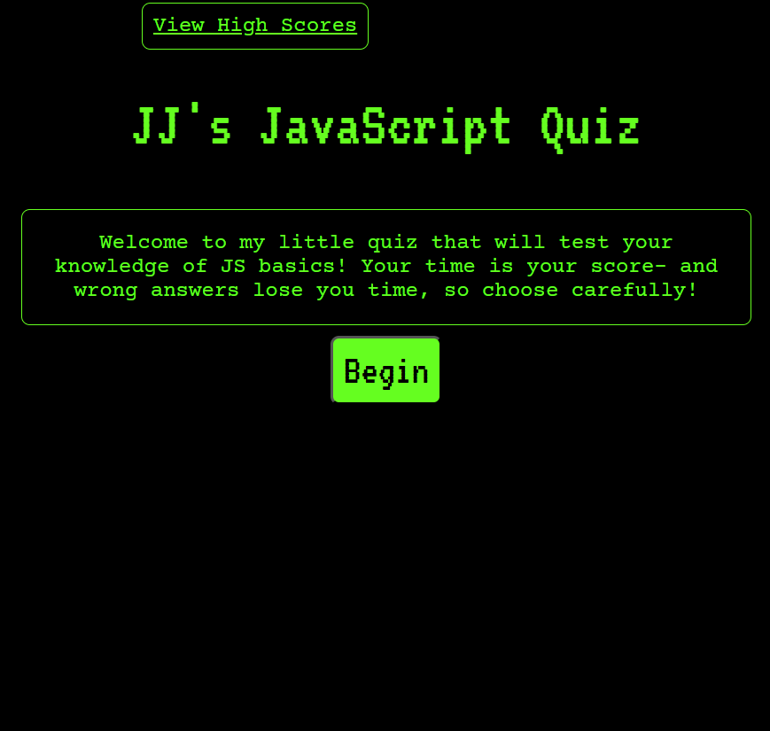
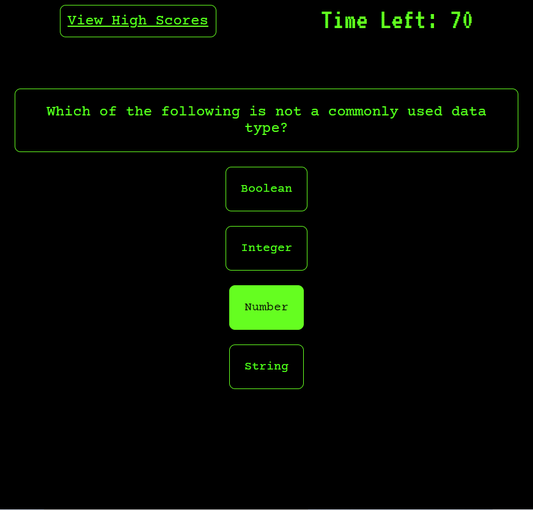

# Timed JavaScript Quiz

## Description

The quiz was developed as way for me to practice my ability working with WebAPIs and traversing the DOM with JavaScript.

## Table of Contents (Optional)

- [Usage](#usage)
- [Credits](#credits)
- [License](#license)

## Usage

Clicking on the start button will begin the quiz. Correct answers will add 5 seconds to your timer, but wrong answers will subtract 10 seconds. At the end of the game, users will be prompted to enter their intials and their time and initials will be saved together in the high score page.

## License

